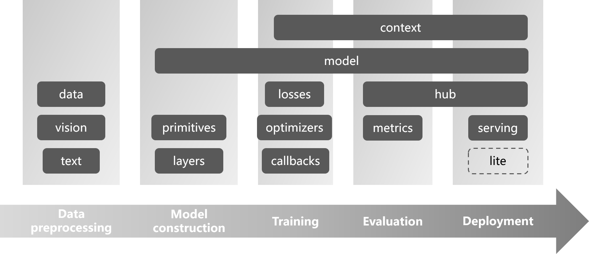

<p align="center"></p>

# TinyMS

[](https://pypi.org/project/tinyms)
[](https://badge.fury.io/py/tinyms)
[](https://pepy.tech/project/tinyms)
[](https://hub.docker.com/r/tinyms/tinyms)
[](https://github.com/tinyms-ai/tinyms/actions/workflows/install_and_test.yml)
[](https://readthedocs.org/projects/tinyms)
[](https://github.com/tinyms-ai/tinyms/releases)
[](https://github.com/tinyms-ai/tinyms/blob/main/LICENSE)
[](https://join.slack.com/t/mindspore/shared_invite/zt-dgk65rli-3ex4xvS4wHX7UDmsQmfu8w)
[](https://github.com/tinyms-ai/tinyms/pulls)

English | [查看中文](./README_CN.md)

TinyMS is an Easy-to-Use deep learning framework development toolkit based on [MindSpore](https://www.mindspore.cn/en/), designed to provide quick-start guidelines for machine learning beginners.

<p align="center"></p>

## Installation

| Distribution | Version | Command |
| :----------- | :------ | :------ |
| PyPI | x.y.z | `pip install tinyms==x.y.z` |
|  | latest | `pip install git+https://github.com/tinyms-ai/tinyms.git` |
| Docker | x.y.z | `docker pull tinyms==x.y.z` |
|  | latest | - |

> **NOTICE:** The `x.y.z` version shown above should be replaced with the real version number.

Please checkout the [install document](https://tinyms.readthedocs.io/en/latest/quickstart/install.html) to quickly install or upgrade TinyMS project.

## Quick start

Have no idea what to do with TinyMS❓ See the [Quick Start](https://tinyms.readthedocs.io/en/latest/quickstart/quickstart_in_one_minute.html) to implement the image classification application in one minutes❗

Besides, here are some use cases listed to demonstrate how TinyMS simplifies the code flow for users.

### Data loading and preprocess

<table>
<tr>
<td>

```python
from tinyms.data import MnistDataset, download_dataset
from tinyms.vision import mnist_transform

data_path = download_dataset('mnist')
mnist_ds = MnistDataset(data_path, shuffle=True)
mnist_ds = mnist_transform.apply_ds(mnist_ds)
```

</td>
</tr>
</table>

### Network construction

<table>
<tr>
<td>

```python
from tinyms.model import lenet5

net = lenet5(class_num=10)
```

</td>
</tr>
</table>

### Model train/evaluation

<table>
<tr>
<td>

```python
from tinyms.model import Model

model = Model(net)
model.compile(loss_fn=net_loss, optimizer=net_opt, metrics=net_metrics)
model.train(epoch_size, train_dataset)
model.save_checkpoint('./checkpoint_lenet.ckpt')
···
model.load_checkpoint('./checkpoint_lenet.ckpt')
model.eval(eval_dataset)
```

</td>
</tr>
</table>

### Model prediction

<table>
<tr>
<td>

```python
from PIL import Image
import tinyms as ts
from tinyms.model import Model, lenet5
from tinyms.vision import mnist_transform

img = Image.open(img_path)
img = mnist_transform(img)

net = lenet5(class_num=10)
model = Model(net)
model.load_checkpoint('./checkpoint_lenet.ckpt')

input = ts.expand_dims(ts.array(img), 0)
res = model.predict(input).asnumpy()
print("The label is:", mnist_transform.postprocess(res))
```

</td>
</tr>
</table>

## API documentation

If you are interested in learning TinyMS API, please find TinyMS Python API in [API Documentation](https://tinyms.readthedocs.io/en/latest/tinyms/tinyms.html).

## Tutorial

For a more detailed step-by-step video tutorial, please refer to the following website.

| Episode | Title | Content | Docs | Status | Update Time |
| ------- | ----- | ------- | ---- | ------ | ----------- |
| EP01    | [How to learn Deep Learning? The Most Efficient Way For Beginners!](https://www.bilibili.com/video/BV1MB4y1P79S) | Teacher's profile+DeepLearning Course Introduction | - | Published | 2021.3.30 |
| EP02    | [How we teach computers to understand pictures? Three Ways to Install TinyMS](https://www.bilibili.com/video/BV18v41187fX) | It uncovers the magic of computer vision + three ways to install TinyMS (Ubuntu, Win10, Docker) | [TinyMS Installation For Beginners](https://tinyms.readthedocs.io/zh_CN/latest/quickstart/install.html) | Published | 2020.3.31 |
| EP03    | [Learn Shell Script in 30 Minutes](https://www.bilibili.com/video/BV1vy4y1b7jh) | It covers the essential concepts such as using variables, basic operators, loops & functions and so on. It also gives you an insight by scaling down some real-time scenarios and demonstrating them using the docker container. | [Learn Shell Script in 30 Minutes (doc)](https://github.com/tinyms-ai/tinyms/blob/main/tutorials/EP03/30min速成Shell脚本.md) | Published | 2020.4.1 |
| EP04    | [Learn Python in 30 Minutes(Part I.)](https://www.bilibili.com/video/BV1Tp4y1b7UG?spm_id_from=333.999.0.0) | Python installation, basic syntax, primitive data types and operators| [Learn Python in 30 Minutes](https://github.com/tinyms-ai/tinyms/blob/main/tutorials/EP04/Quickstart-for-Python-in-30-minutes.md) | Published | 2021.4.23    |
| EP05    | [Learn Python in 30 Minutes(Part II.)](https://www.bilibili.com/video/BV1XS4y1Z7yp?spm_id_from=333.999.0.0) | Python conditional statements, loop statements, iterators, generators, functions, class, module, advanced usages, and several most commonly used Python libraries in deep learning | [Learn Python in 30 Minutes](https://github.com/tinyms-ai/tinyms/blob/main/tutorials/EP04/Quickstart-for-Python-in-30-minutes.md) | Published | 2022.1.10    |

## Community

For any developers who are not familiar with how TinyMS community works, please find the [Contributing Guidelines](https://tinyms.readthedocs.io/en/latest/community/contributing.html) to get started.

## Release Notes

The release notes, see our [RELEASE](https://github.com/tinyms-ai/tinyms/blob/main/RELEASE.md).

## License

[Apache License 2.0](https://github.com/tinyms-ai/tinyms/blob/main/LICENSE)
