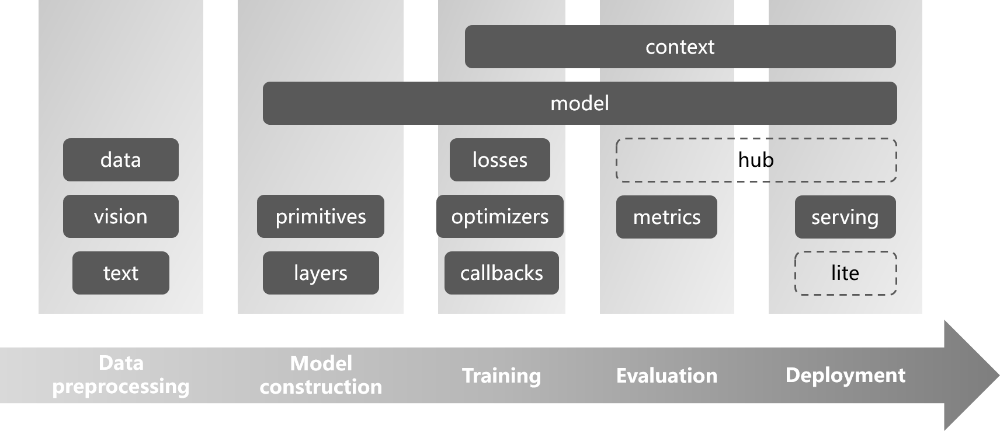
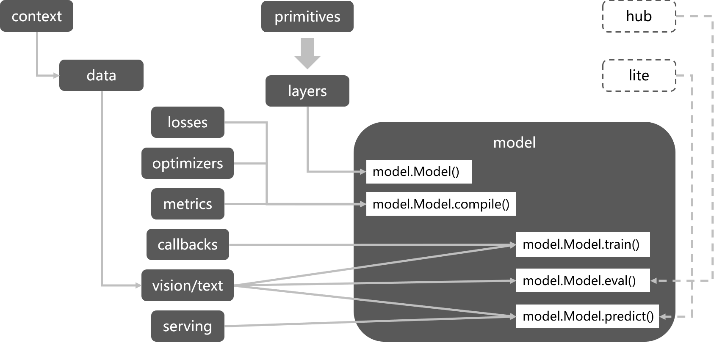

# Design Concept

## Background

In recent years, with the rapid development of AI technology, deep learning frameworks such as TensorFlow, PyTorch, Apache MXNet and MindSpore have emerged. These frameworks are very good at solving problems for academic research or commercial production, however for first time beginners or application developers with limited deep learning knowledge, much simpler APIs are desired. Alongside the existing efforts like Keras for TensorFlow and Fastai for PyTorch to address the issue, the TinyMS project is a new addition in this field to provide simple high level APIs, tiny runtime footprint, modular development and agile deployment. TinyMS begins with initial focus on MindSpore integration and looks forward to more framework adaptations in the long run.

Interestingly enough, MindSpore's high-level and mid-level Python APIs have already implemented most of the functions of Keras, and also been on par with Fastai's design for PyTorch's flexibility. Therefore unlike Keras and Fastai which are developed with most of their goals to compensate the underlying frameworks, TinyMS is designed to further enhance the experience of the framework, especially for all scenario development in the case of MindSpore.

With the help of TinyMS, the following goals should be achieved:

* Quicker to learn: Get started with AI application development in one minute
* Easier to develop: Complete the task of changing AI models and dataset from one to the other in one hour

## Architecture

Design goals of TinyMS:

* High level API that are extremely simple to learn and use.
* Support complete AI development workflow from data preparation to model training/inference and finally deployment.
* Decoupled modules that are could be easily extended.
* Small runtime footprint that could be used on mobile, edge or cloud.
* Standardizing spec for model training script format.



### Workflow analysis

Typical model development workflow:

* **Data Acquisition**: Dataset download, decompression, loading, etc.
* **Data Processing**: Data preprocessing (enhancement) operations performed on the original dataset for better model performance.
* **Model Construction**: Construction of the network, and also the definition of loss function, optimizer, etc.
* **Model Training**: The process of model training, including the definition of callbacks
* **Accuracy Verification**: The process of model accuracy verification, including the definition of metrics
* **Model Deployment**: Model application services via an inference server



### Module design

TinyMS has the following modules:

| Name | Introduction | Example Code |
| :--- | :----------- | :----------- |
| app | Support OpenCV to Achieve Model Reasoning Visualization | `from tinyms.app import object_detection` |
| data | Dataset Loading and Downloading | `from tinyms.data import MnistDataset, download_dataset` |
| hub | Pre-trained Model Hub for Inference and Transfer Learning | `from tinyms import hub` |
| model | Model High Level API and Predefined Network | `from tinyms.model import Model, lenet5` |
| serving | Model Serving | `from tinyms.serving import predict` |
| vision | Computer Vision Related Data Processing | `from tinyms.vision import mnist_transform, Resize` |
| text | Natural Language Processing Related Data Processing | `from tinyms.text import Lookup` |
| callbacks | Callbacks During Model Training | `from tinyms.callbacks import ModelCheckpoint` |
| common | Basic Components Including Tensor, Numpy Style Functions | `from tinyms import Tensor, array` |
| context | Global Context | `from tinyms import context` |
| initializers | Ops Weight Initialization  | `from tinyms.initializers import Normal` |
| layers | Neural Network Layer | `from tinyms.layers import Layer, Conv2d` |
| losses | Loss Function | `from tinyms.losses import SoftmaxCrossEntropyWithLogits` |
| metrics | Metrics For Model Verification | `from tinyms.metrics import Accuracy` |
| optimizers | Optimizer | `from tinyms.optimizers import Momentum` |
| primitives | Basic Ops | `from tinyms.primitives import Add, tensor_add` |

## Implementation

### Data loading (*data*)

The data loading module is mainly divided into two parts: dataset download and loading. Through TinyMS's data loading API, developers can complete the entire process of downloading, decompressing, formatting, and loading common datasets with just two lines of code.

Most AI frameworks do not provide an interface for dataset download. Users need to prepare the dataset in advance, and at the same time, adjust the format (training/validation data set division, etc.) according to the data loading API format provided by the framework itself. To make dataset API usage much more easier, TinyMS provides the `download_dataset` interface, which supports users to complete the download, decompression and format adjustment operations of the data set with one click; use [Mnist](http://yann.lecun.com/exdb/mnist/) dataset as an example:

```python
from tinyms.data import download_dataset

mnist_path = download_dataset('mnist', local_path='./')
```

For data loading operations, TinyMS completely inherits MindSpore's native [Data Loading API](https://www.mindspore.cn/doc/api_python/en/r1.2/mindspore/mindspore.dataset.html). Users can use the xxxDataset interface to instantiate different data sets very conveniently. Take [MnistDataset](https://www.mindspore.cn/doc/api_python/en/r1.2/mindspore/dataset/mindspore.dataset.MnistDataset.html#mindspore.dataset.MnistDataset) as an example:

```python
from tinyms.data import MnistDataset

mnist_ds = MnistDataset(mnist_path, shuffle=True)
```

### Data preprocessing (*vision*, *text*)

Usually in the model development workflow, data processing presents a big challenge: insufficient data, heavy manual labeling task, irregular data format and many other issues. Any of them could affect the network accuracy after training. Most frameworks provide data processing modules. Take MindSpore as an example, it currently provides data processing functions for common scenarios such as CV and NLP (for relevant interface definitions, please refer to [`mindspore.dataset.vision`](https://www.mindspore.cn/doc/api_python/en/r1.2/mindspore/mindspore.dataset.vision.html) and [`mindspore.dataset.text`](https://www.mindspore.cn/doc/api_python/en/r1.2/mindspore/mindspore.dataset.text.html)), the user can directly call the preset data processing operator to process pictures or text, and then construct a data processing pipeline to efficiently parallelize massive data (see [here](https://www.mindspore.cn/news/newschildren?id=399)).

TinyMS has made further abstraction and encapsulation on the basis of MindSpore, and directly corresponds to the processing of the dataset itself through the `DatasetTransform` interface, allowing users to utilize a single piece of data or the entire dataset with just one line of code regarding preprocessing operation; take `MnistTransform` as an example:

```python
from PIL import Image
from tinyms.vision import mnist_transform

# Preprocessing a single one picture
img = mnist_transform(Image.open('picture.jpg'))
# Apply preprocessing to MnistDataset class instance
mnist_ds = mnist_transform.apply_ds(mnist_ds)
```

### Model construction (*model*)

As the core of deep learning model development, the ​​framework's main responsibility is to provide complete operator expressions to build different network structures. Therefore, the interfaces at the ​​framework level focus more on functional completeness and flexibility, whereas ModelZoo is provided for application development. TinyMS encapsulates the relevant network call API on the ModelZoo script; take the `LeNet5` network as an example:

```python
from tinyms.model import lenet5

net = lenet5(class_num=10)
```

In addition to encapsulating the commonly used network structures, TinyMS also provides a `Model` high-level API interface (based on [MindSpore Model](https://www.mindspore.cn/doc/api_python/en/r1.2/mindspore/mindspore.html#mindspore.Model) interface package), by drawing on the design idea of ​​[Keras Model](https://keras.io/api/models/model/#model-class) interface, it not only improves the original API functionalities, but also provides a consistent development experience for Keras users who wants to try TinyMS:

```python
from tinyms.model import Model

model = Model(net)
model.compile(loss_fn=net_loss, optimizer=net_opt)
```

### Model training (*losses*, *optimizers*, *callbacks*)

For the model training phase, the most important factors are the definitions of loss functions, optimizers, and callback functions. For beginners, it is not difficult to understand the basic principles of loss functions and optimizers, but a strong mathematical background is required to understand the principles of implementation. Therefore, the TinyMS high-level API encapsulates the loss function and optimizer at the network level, so that users can complete the initialization work with one line of code whether they are training simple or complex networks; take the `LeNet5` network as an example:

```python
from tinyms.losses import SoftmaxCrossEntropyWithLogits
from tinyms.optimizers import Momentum

lr = 0.01
momentum = 0.9
net_loss = SoftmaxCrossEntropyWithLogits(sparse=True, reduction='mean')
net_opt = Momentum(net.trainable_params(), lr, momentum)
```

Regarding the definition of callback functions, in addition to commonly used callback functions (such as `TimeMonitor`, `LossMonitor`, etc.), MindSpore itself provides [Callback](https://www.mindspore.cn/doc/api_python/en/r1.2/mindspore/mindspore.train.html#mindspore.train.callback.Callback) interface to facilitate user-defined callback functions. The TinyMS high-level API also provides network-level encapsulation, so that users can complete the initialization of the callback function with one line of code; take the `MobileNetV2` network as an example:

```python
from tinyms.callbacks import mobilenetv2_cb

net_cb = mobilenetv2_cb(device_target, lr, is_saving_checkpoint, save_checkpoint_epochs, step_size)
```

### Model evaluating (*metrics*)

Model accuracy verification is an indispensable process to verify whether the model accuracy meets the SOTA criteria. MindSpore natively provides measurement interfaces for indicators such as `Accuracy` and `Precision` (see [here](https://www.mindspore.cn/doc/api_python/en/r1.2/mindspore/mindspore.nn.html#metrics)), while providing users with a custom measurement interface `Metric`. In terms of metric measurement, TinyMS directly inherits the native MindSpore API:

```python
from tinyms.model import Model
from tinyms.metrics import Accuracy

model = Model(net)
model.compile(metrics={"Accuracy": Accuracy())
```

### Pre-trained model loading (*hub*)

TinyMS Hub is a pre-trained model application tool, serving as a channel for model developers and application developers.

- Provide model developers with a convenient and fast channel for model release and submission.
- Provide application developers with high-quality pre-trained models, and complete the work of model migration to deployment quickly using model loading and fine-tuning APIs.

Current pre-trained models in TinyMS Hub mainly cover four mainstream task scenarios including `image classification`, `object detection`, `semantic segmentation` and `recommendation`.

There are several of scenarios for users to leverage `hub` to easily load the pre-trained model:

* Load pre-trained model

    ```python
    from PIL import Image
    from tinyms import hub
    from tinyms.vision import mnist_transform
    from tinyms.model import Model

    img = Image.open(img_path)
    img = mnist_transform(img)

    # load LeNet5 pre-trained model
    net= hub.load('tinyms/0.2/lenet5_v1_mnist', class_num=10)
    model = Model(net)

    res = model.predict(ts.expand_dims(ts.array(img), 0)).asnumpy()
    print("The label is:", mnist_transform.postprocess(res))
    ```

* Load model checkpoint

    ```python
    from tinyms import hub
    from tinyms.model import lenet5
    from tinyms.utils.train import load_checkpoint

    ckpt_dist_file = '/tmp/lenet5.ckpt'
    hub.load_checkpoint('tinyms/0.2/lenet5_v1_mnist', ckpt_dist_file)
    net = lenet5()
    load_checkpoint(ckpt_dist_file, net=net)
    ```

* Load model weights

    ```python
    from tinyms import hub
    from tinyms.model import lenet5
    from tinyms.utils.train import load_param_into_net

    param_dict = hub.load_weights('tinyms/0.2/lenet5_v1_mnist')
    net = lenet5()
    load_param_into_net(net, param_dict)
    ```

### Model deployment (*serving*)

Model deployment refers to the process of servicing pre-trained models so that they can quickly and efficiently process data input by users and obtain results. MindSpore provides the [predict](https://mindspore.cn/doc/api_python/en/r1.2/_modules/mindspore/train/model.html#Model.predict) function for inference. TinyMS provides a complete set of start server (`start_server`), check backend (`list_servables`), check start status (`server_started`) and shut down the server (`shutdown`) and other functions based on [Flask](https://flask.palletsprojects.com/en/1.1.x/) ; Take the `LeNet5` network as an example:

```python
from tinyms.serving import Server, Client

server = Server()
# Start prediction server
server.start_server()

client = Client()
# List all servables available
client.list_servables()
# Call predict interface
client.predict(image_path, 'lenet5', dataset_name='mnist')
# Shutdown the prediction server
server.shutdown()
```

In addition, TinyMS also provides a web visualization interface, convenient for users to directly upload a picture on the web page for reasoning, currently mainly support `LeNet5`, `CycleGan` and `SSD300` network. The developers only need to start the backend reasoning server, then deploy the front-end server through Nginx web server, The front-end project is stored in the `tinyms/serving/web directory` of the TinyMS project. If users want to try quickly, can visit [Install TinyMS](https://tinyms.readthedocs.io/en/latest/quickstart/install.html) `Nginx version` section:

```python
# Start web backend server
from tinyms.serving import Server

server = Server()
server.start_server()
```

### Model reasoning visualization application（*app*）

OpenCV is a library for computer vision, and TinyMS is a high-level API library for deep learning frameworks. Usually after training, when we need to load the pre-training model to verify the effect of the model, the result is usually a bunch of numbers. The data is boring and unintuitive for beginners, and it is very difficult to understand what they represent. Therefore, TinyMS takes model reasoning visualization as its main feature in version 0.3.0, and combines OpenCV to realize real-time detecting and visual detection of images to help users see the effect of reasoning more intuitively. At present, the visual reasoning module only supports object detection model `SSD300`, and more image processing models will be added in the future.

Below, I will demonstrate how to use a trained model to detect static images and live, moving video images captured by computer cameras in just `5` steps:

* Static image object detection

```python
import cv2

from tinyms.app.object_detection.utils.config_util import load_and_parse_config
from tinyms.app.object_detection.object_detector import ObjectDetector, object_detection_predict
from tinyms.app.object_detection.utils.view_util import visualize_boxes_on_image

# 1.Load and parse the config json file
config_path = '**/ssd300_shanshui.json'
config = load_and_parse_config(config_path=config_path)

# 2.Generate the instance of ObjectDetector
detector = ObjectDetector(config=config)

# 3.Read the input image using OpenCV
img_path = ('./pic/test.jpeg)
image_np = cv2.imread(img_path)
input = image_np.copy()

# 4.Detect the input image
detection_bbox_data = object_detection_predict(input, detector, is_training=False)

# 5.Draw the box for the input image and and view it using OpenCV.
detection_image_np = visualize_boxes_on_image(image_np, detection_bbox_data, box_color=(0, 255, 0),
                                              box_thickness=3, text_font=cv2.FONT_HERSHEY_PLAIN,
                                              font_scale=2, text_color=(0, 0, 255), font_size=3, show_scores=True)
cv2.imshow('object detection image', cv2.resize(detection_image_np, (600, 1000)))
cv2.waitKey(0)
```

* Real-time dynamic detection of video images collected by computer camera

```python
import cv2

from tinyms.app.object_detection.utils.config_util import load_and_parse_config
from tinyms.app.object_detection.object_detector import ObjectDetector, object_detection_predict
from tinyms.app.object_detection.utils.view_util import visualize_boxes_on_image

# 1.Load and parse the config json file
config_path = "**/tinyms/app/object_detection/configs/tinyms/0.3/ssd300_voc.json"
config = load_and_parse_config(config_path=config_path)

# 2.Generate the instance of ObjectDetector
detector = ObjectDetector(config=config)

cap = cv2.VideoCapture(0)
while True:
    # 3.Read the frame image from the camera using OpenCV
    ret, image_np = cap.read()
    input = image_np.copy()

    # 4.Detect the input frame image
    detection_bbox_data = object_detection_predict(input, detector, is_training=False)

    # 5.Draw the box for the input frame image and view it using OpenCV.
    detection_image_np = visualize_boxes_on_image(image_np, detection_bbox_data, box_color=(0, 255, 0),
                                                  box_thickness=3, text_font=cv2.FONT_HERSHEY_PLAIN,
                                                  font_scale=2, text_color=(0, 0, 255), font_size=3, show_scores=True)
    cv2.imshow('object detection camera', cv2.resize(detection_image_np, (800, 600)))

    if cv2.waitKey(25) & 0xFF == ord('q'):
        break

cap.release()
cv2.destroyAllWindows()
```