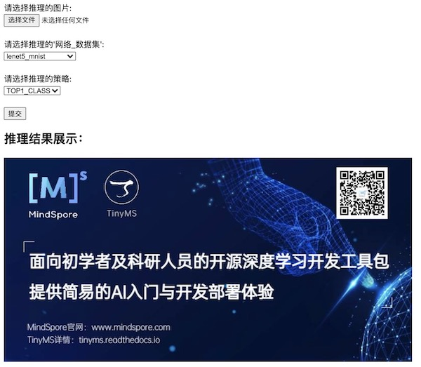
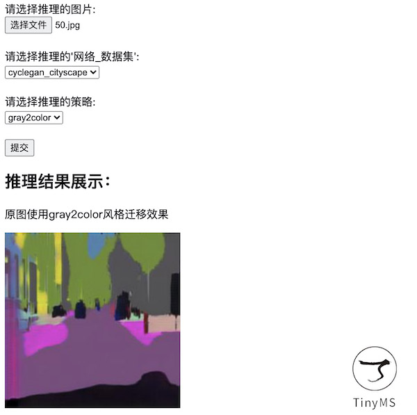
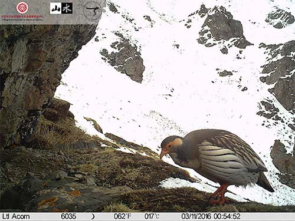
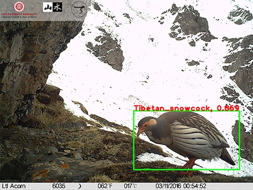

# TinyMS Reasoning Visualization Experience

Combined with OpenCV image vision library, TinyMS V0.3.0 focus visualization features. Through simple and intuitive image visualization, it helps users to understand the effect of model reasoning more quickly.

For users who do not want to write code, TinyMS provides a visual interface of WEB UI. Users only need to upload the image to be inferred on the browser page to experience easily. Currently, it supports for `LeNet5`, `CycleGan` and `SSD300` models.

### WEB UI reasoning visualization

Users need to deploy the visual server first, details please see [TinyMS Nginx Verion Installation](https://tinyms.readthedocs.io/en/latest/quickstart/install.html). After the server is successfully deployed, the home page and reasoning effect page (taking `CycleGan` model as an example) presented by the browser are as follows:





For users who want to run code, TinyMS provides model reasoning visualization module, which only needs `5` step code to experience quickly. Currently, it only supports `SSD300` object detection model.

### Model reasoning visualization module application

If users need to experience the model reasoning visualization module application for the first time, they can download code from [TinyMS Official Repo](https://github.com/tinyms-ai/tinyms), then do the following operations:

* Static image detection

Note: Please make sure your system has a visual desktop.

```script
# Download the TinyMS project
git clone https://github.com/tinyms-ai/tinyms.git
cd tinyms/tests/st/app/object_detection/
# Run static image detection
python opencv_image_app.py
```

The image to be detected and the image after inference are shown as follows:





* Real-time dynamic detection of video images collected by computer camera

Note: In addition to ensuring that your system has a visual desktop, you also need to have a camera.

If using the container to run code, the camera of the host must be mounted to the container. For example, the host is Ubuntu 18.04 with a camera device and a visual desktop. Perform from step 1 to the final.  If using the host server, perform from step 4 to the final.

```script
# 1.Install xServer on the host and set permissions
apt install x11-xserver-utils
# 2.Allow all users to access the display interface
xhost +
# 3.Run container
docker run -it --rm --device=/dev/video0 -e DISPLAY=unix$DISPLAY -v /tmp/.X11-unix:/tmp/.X11-unix tinyms/tinyms:0.3.0 /bin/bash
# 4.Download the TinyMS project in the container
git clone https://github.com/tinyms-ai/tinyms.git
cd tinyms/tests/st/app/object_detection/
# 5.Run dynamic video image detection collected by camera
python opencv_camera_app.py
```
