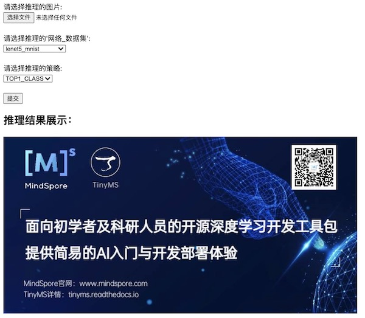
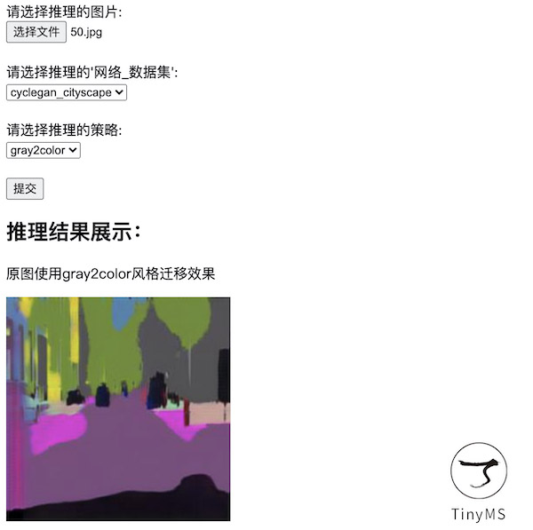
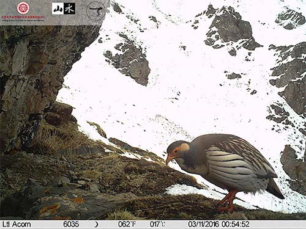
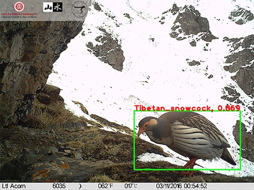

# TinyMS推理可视化体验

结合OpenCV图像视觉库，TinyMS v0.3.0聚焦可视化特性。通过简单直观的图片可视化，帮助用户更快地了解模型推理的效果。

针对不想编写代码的用户，TinyMS提供了WEB UI可视化界面，用户只需在浏览器页面上传待推理的图片即可轻松体验，当前提供了`LeNet5`、`CycleGan`和`SSD300`模型的支持。

### WEB UI推理可视化

用户需要先部署可视化服务器，详情请看[Nginx版本的TinyMS](https://tinyms.readthedocs.io/zh_CN/latest/quickstart/install.html)安装。服务器部署成功后，访问浏览器呈现的首页和推理效果页（以`CycleGan`模型为例）如下：





针对想运行代码的用户，TinyMS提供了模型推理可视化模块，仅需`5`步骤代码即可快速体验，当前仅提供`SSD300`对象检测模型的支持。

### 模型推理可视化模块应用

如果您需要第一时间体验模型推理可视化模块应用，可下载[TinyMS官方仓项目](https://github.com/tinyms-ai/tinyms)代码，执行如下操作：

* 静态图像检测

注：请确保您的系统有可视化桌面

```script
# 下载tinyms项目
git clone https://github.com/tinyms-ai/tinyms.git
cd tinyms/tests/st/app/object_detection/
# 运行静态图像检测
python opencv_image_app.py
```

待检测图片和执行推理后的图片展示如下：





* 摄像头采集的动态视频图像检测

注：除确保您的系统有可视化桌面，还需带有摄像头。

若使用容器访问，则容器需要挂载主机的摄像头，如: 宿主机是带有摄像头设备和可视化桌面的Ubuntu 18.04系统, 从步骤1开始执行；若直接在宿主机运行，则从步骤4开始执行：

```script
# 1.在宿主机内安装xserver，并设置权限
apt install x11-xserver-utils
# 2.允许所有用户访问显示接口
xhost +
# 3.运行容器
docker run -it --rm --device=/dev/video0 -e DISPLAY=unix$DISPLAY -v /tmp/.X11-unix:/tmp/.X11-unix tinyms/tinyms:0.3.0 /bin/bash
# 4.在容器内下载tinyms项目
git clone https://github.com/tinyms-ai/tinyms.git
cd tinyms/tests/st/app/object_detection/
# 5.运行摄像头采集的动态视频图像检测
python opencv_camera_app.py
```
