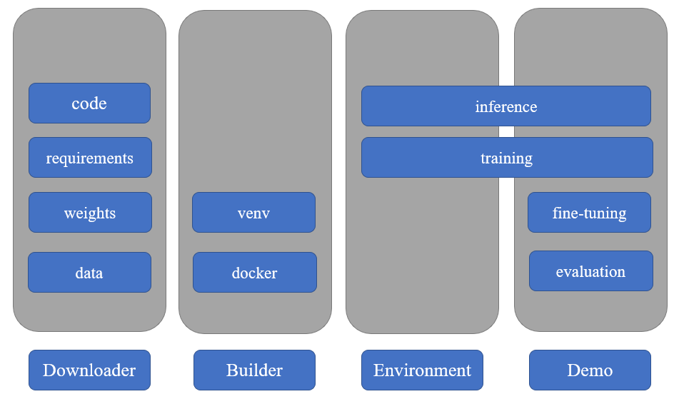

# 昇思大模型平台相关工具组件开发
[任务来源](https://gitee.com/mindspore/community/issues/I87G7E)

实现一套可以线下使用的API，使得从昇思大模型平台中下载SOTA模型，并实现预训练、训练、评估、推理等功能成为可能。
## 组件及功能划分
- SOTA模型下载组件：
    - 提供API接口，接收模型名称和版本等参数。
    - 连接到昇思大模型平台，下载指定模型到本地。
- 本地推理环境构建组件：
    - 利用venv或docker构建独立运行环境。
    - 配置运行环境，安装依赖包。
- 预训练、训练、评估、推理组件：
    - 针对下载的模型，提供API接口实现预训练、训练、评估、推理等功能。
    - 利用TinyMS框架，封装高效且易用的接口。
- Demo设计组件：
    - 根据下载的平台大模型代码，运行Demo应用。
    - 涵盖各个功能点，用于验证组件的正确性和完整性。
## 架构图示

## 计划与排期
- 第一周：需求调研与架构设计
    - 详细了解昇思大模型平台的API结构和功能。
    - 设计架构，并提交 proposal PR 进行讨论。
- 第二至四周：SOTA模型下载组件实现
    - 开发SOTA模型下载的API接口。
    - 测试下载功能。
- 第五至六周：预训练、训练、评估、推理组件实现
    - 实现与下载的模型相关的预训练、训练、评估和推理的API接口。
- 第七至八周：Demo设计组件实现
    - 设计并实现演示Demo，确保覆盖所有功能点。
- 第九至十周：测试用例编写与调试
    - 编写全面的测试用例，确保各组件的正确性。
    - 进行整体调试和优化。
- 第十一周：文档编写
    - 撰写详细的文档，包括API使用说明、Demo示例等。
- 第十二周：最终测试与PR提交
    - 进行最终的整体测试。
    - 提交功能性PR，并进行最终的讨论和调整。