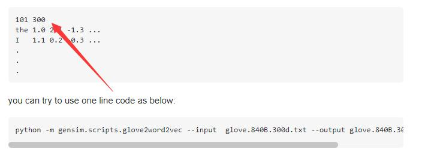
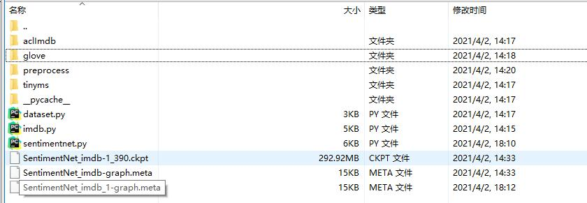

# sentimentnet的使用方法
```
python sentimentnet.py \
--device_target {your device} \
--preprocess true \
--aclimdb_path {your aclimdb_path} \
--glove_path {your golve_path}
```
如果遇到加载glove报错的问题
参考
[Can't load glove.6B.300d.txt](https://stackoverflow.com/questions/51323344/cant-load-glove-6b-300d-txt)
也就是给这个文件第一行加入101 300
如下图所示


aclimdb_path和glove_path默认地址也可以这样子放



