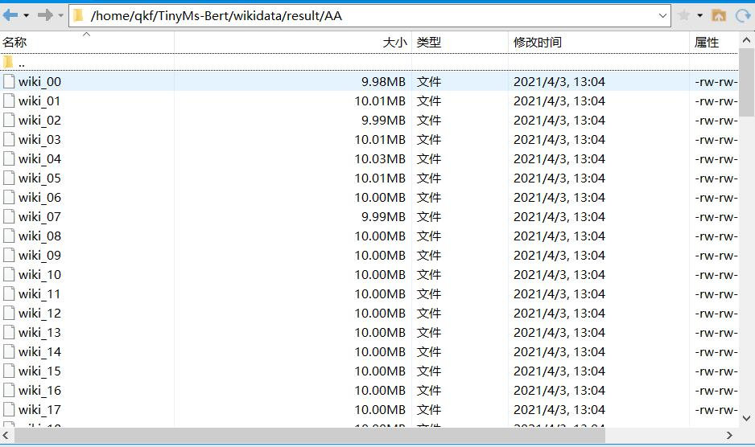
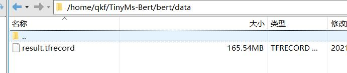
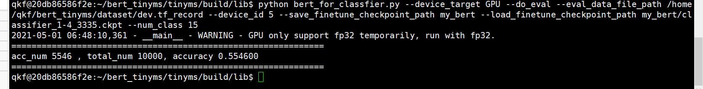

#### 由于代码太多，放进去可能弄乱tinyms的接口，就没有放到tinyms里面了


#### 代码来源
https://gitee.com/mindspore/mindspore/tree/master/model_zoo/official/nlp/bert
其中能在TinyMs中找到的可以替换的api都已经替换，部分核心功能TinyMs暂时还没有，只能使用mindspore的了


#### download-data
参考上述网站中的介绍，下载数据
https://dumps.wikimedia.org/zhwiki/20201220/zhwiki-20201220-pages-articles-multistream.xml.bz2

然后再下载语料库，这里使用的是
https://doc-0k-58-docs.googleusercontent.com/docs/securesc/klj5bu58tus5f0itgn8csf9r66a9e8jd/572sogun9vjs8kutigenej64bl0ar8jh/1617412800000/05961793937965181111/17035874997722390898/1AQitrjbvCWc51SYiLN-cJq4e0WiNN4KY?e=download&authuser=0&nonce=hnmrljnqvdoo6&user=17035874997722390898&hash=cdbistk2lscdf6tctgkduh5al3ecerk0

网站中的语料库文件vocab.txt


#### 预处理数据集
参考博客
https://blog.csdn.net/wangxiaosu0501/article/details/104215670
运行程序后可以得到（进行内容提取）


#### 生成预处理数据
参考github
https://github.com/google-research/bert
下载并且按照requirements.txt按照tensorflow>=1.10
然后运行create_pretraining_data.py

```python
python create_pretraining_data.py \
--vocab_file ../chinese_wwm_pytorch/vocab.txt \
--output_file result.tfrecord \
--input_file ../wikidata/result/AA/wiki_00
```
进行预处理，最后生成result.tfrecord
如果要对所有的wiki都进行词向量处理可能要很久，因此就处理了一个


#### 生成预处理数据

放置数据位置，数据地址只要给到data就可以，代码会遍历目录下所有的tfrecord文件

# 开始训练
```pythonr
python bert_for_pre_pretraining.py \
--device_target {your device} \
--device_id {your device id} \
--enable_graph_kernel true \
--data_dir {your data dir}      
```

# 加载模型

``` python
python bert_for_pre_pretraining.py \
--device_target {your device} \
--device_id {your device id} \
--enable_graph_kernel true \
--data_dir {your data dir} \
--load_checkpoint_path {yout cpkt path}
```

#### enable_graph_kernel true
可以图加速算子，可以提升模型的运算效率，接近3成

#### data_dir
data_dir只需要给定文件夹就可以，他会遍历目录下所有的tfrecord文件

#### train_steps
原始全部数据完成一个epoch的训练可能需要2-3天
单卡telsaV100，因此建议使用--train_steps 10
比如只训练10步，用来测试模型能否正常运行即可

### for finetune
#### train
```
python bert_for_classfier.py \
--device_target GPU \
--do_train \
--train_data_file_path {train.tf_record path} \
--device_id 0 \
--save_finetune_checkpoint_path {save_path} \
--load_pretrain_checkpoint_path ../../../bert_base.ckpt \
--num_class 15
```
#### evaluate
```
python bert_for_classfier.py \
--device_target GPU \
--do_eval \
--eval_data_file_path {dev.tf_record path} \
--device_id 0 \
--load_finetune_checkpoint_path {finetune path ckpt} \
--num_class 15
```



