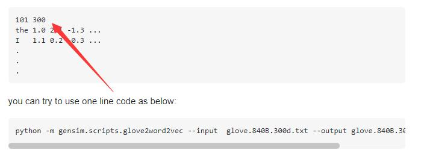

# sentimentnet的使用方法
### for train
```
python sentimentnet.py \
--device_target {your device} \
--preprocess true \
--aclimdb_path {your aclimdb_path} \
--glove_path {your golve_path}
```
### for evaluate
```
python sentimentnet.py \
--device_target {your device} \
--preprocess {true or false} \
--aclimdb_path {your aclimdb_path} \
--glove_path {your golve_path} \
--do_eval True \
--checkpoint_path {your ckpt path}
```
**if preprocess is false,the aclimdb_path and glove_path do not be needed**


如果遇到加载glove报错的问题
参考
[Can't load glove.6B.300d.txt](https://stackoverflow.com/questions/51323344/cant-load-glove-6b-300d-txt)
也就是给这个文件第一行加入101 300
如下图所示


aclimdb_path和glove_path默认地址也可以这样子放


## 下载数据集的方法

根据mindspore的github中
https://github.com/mindspore-ai/mindspore/blob/master/model_zoo/official/nlp/lstm/README_CN.md 的介绍，从两个网站中下载数据集，然后按照glova_path和acllmdb_path中所描述的方式放置数据集即可

## acllmdb
https://ai.stanford.edu/~amaas/data/sentiment/

## glove
http://nlp.stanford.edu/data/glove.6B.zip 使用glove.6B.300d.txt

## 


